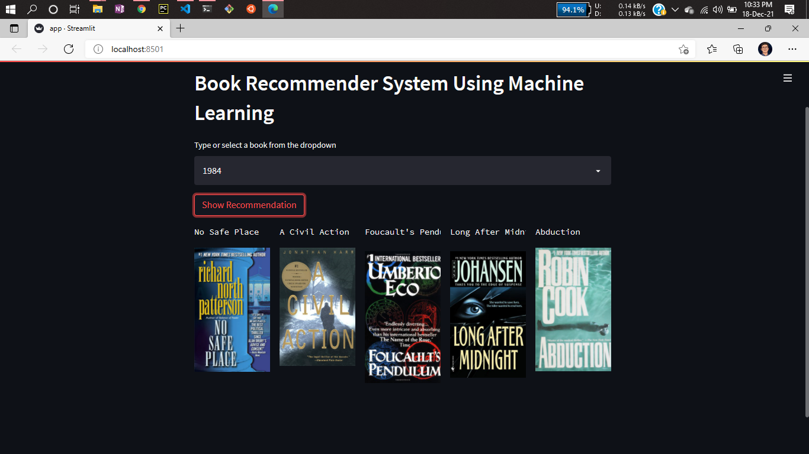
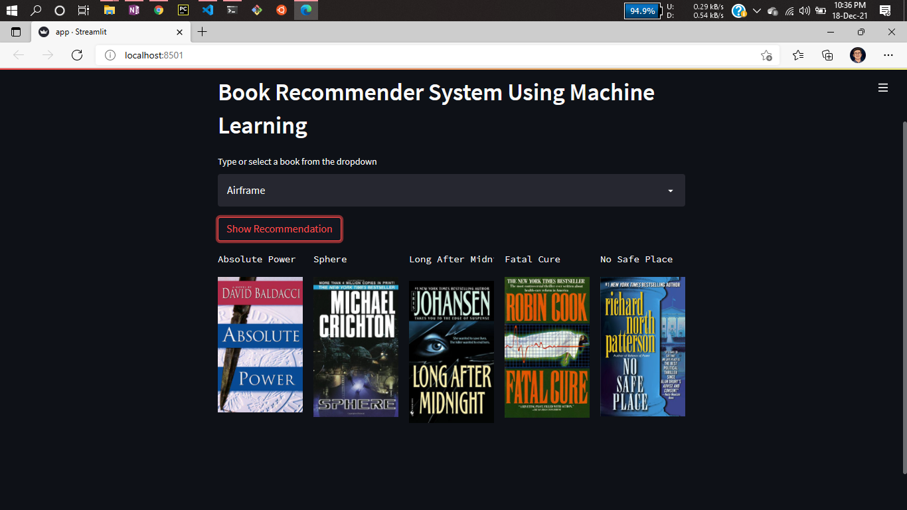

# Project: Book Recommender System Using Machine Learning! | Collaborative Filtering Based


Recommendation systems are becoming increasingly important in today’s extremely busy world. People are always short on time with the myriad tasks they need to accomplish in the limited 24 hours. Therefore, the recommendation systems are important as they help them make the right choices, without having to expend their cognitive resources.

The purpose of a recommendation system basically is to search for content that would be interesting to an individual. Moreover, it involves a number of factors to create personalised lists of useful and interesting content specific to each user/individual. Recommendation systems are Artificial Intelligence based algorithms that skim through all possible options and create a customized list of items that are interesting and relevant to an individual. These results are based on their profile, search/browsing history, what other people with similar traits/demographics are watching, and how likely are you to watch those movies. This is achieved through predictive modeling and heuristics with the data available.

# About this project:

This is a streamlit web application that can recommend various kinds of similar books based on an user interest. Using ML nearest neighbour algorithm.
here is a demo,

* [Click here to run it live on server](https://book-recommendation45.herokuapp.com/)


# Demo:







# Dataset has been used:

* [Dataset link](https://www.kaggle.com/ra4u12/bookrecommendation)


# How to run?
### STEPS:

### STEP 01- Clone the repository

```bash
git clone https://github.com/atulgaikwad12/Books-Recommender-System-ML-Collabrative.git
```

### STEP 02- Download dataset and unzip it in data folder 


### STEP 03- Create a conda environment and activate it

```bash
conda create --prefix ./env python=3.7.10 -y
```

```bash
source activate ./env
```


### STEP 04- Install the requirements
```bash
pip install -r requirements.txt
```

### STEP 05- Open jupyter notebook with current environment
```bash
jupyter-notebook
``` 
### Run below notebook to generate the models (will be saved inside artifacts)
```bash
Books Recommender.ipynb
```

### STEP 06- Start application execute
```bash
streamlit run app.py
```

### STEP 07- Create your repo and save your version of project use below command to do the same
```bash
git init
git add .
git status
git commit -m "first commit"
git branch -M main
git remote add origin https://github.com/atulgaikwad12/Books-Recommender-System-ML-Collabrative.git
git push -u origin main
```


